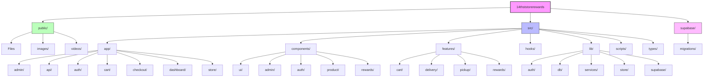

```mermaid
graph TD
    Root[14thststorerewards] --> Public[public/]
    Root --> Src[src/]
    Root --> Supabase[supabase/]

    %% Public directory
    Public --> PublicFiles[Files]
    Public --> Images[images/]
    Public --> Videos[videos/]

    %% Src directory
    Src --> App[app/]
    Src --> Components[components/]
    Src --> Features[features/]
    Src --> Hooks[hooks/]
    Src --> Lib[lib/]
    Src --> Scripts[scripts/]
    Src --> Types[types/]

    %% App subdirectories
    App --> Admin[admin/]
    App --> API[api/]
    App --> Auth[auth/]
    App --> Cart[cart/]
    App --> Checkout[checkout/]
    App --> Dashboard[dashboard/]
    App --> Store[store/]

    %% Components subdirectories
    Components --> UIComponents[ui/]
    Components --> AdminComponents[admin/]
    Components --> AuthComponents[auth/]
    Components --> ProductComponents[product/]
    Components --> RewardsComponents[rewards/]

    %% Features subdirectories
    Features --> CartFeature[cart/]
    Features --> DeliveryFeature[delivery/]
    Features --> PickupFeature[pickup/]
    Features --> RewardsFeature[rewards/]

    %% Lib subdirectories
    Lib --> LibAuth[auth/]
    Lib --> LibDB[db/]
    Lib --> LibServices[services/]
    Lib --> LibStore[store/]
    Lib --> LibSupabase[supabase/]

    %% Supabase directory
    Supabase --> Migrations[migrations/]

    style Root fill:#f9f,stroke:#333,stroke-width:2px
    style Src fill:#bbf,stroke:#333,stroke-width:1px
    style Public fill:#bfb,stroke:#333,stroke-width:1px
    style Supabase fill:#fbf,stroke:#333,stroke-width:1px
```